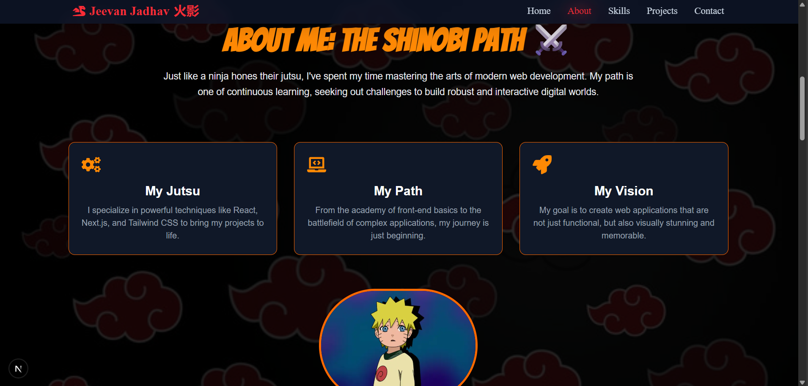
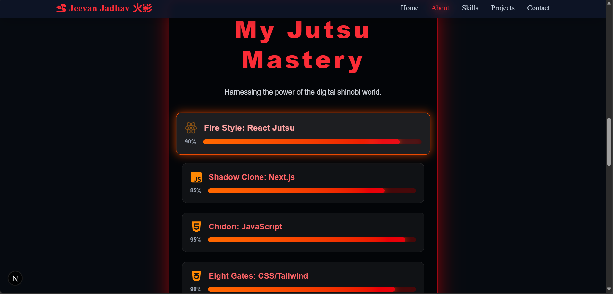
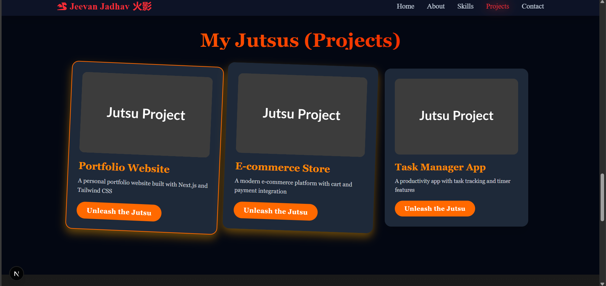
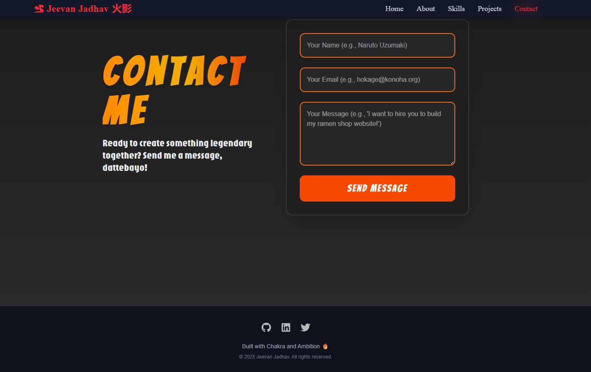

# 🌟 Portfolio Template — Built with Next.js & Tailwind CSS  

Welcome to **Portfolio Template** — a sleek, modern developer portfolio crafted with **Next.js** and **Tailwind CSS** to showcase _your best work_, skills, and professional journey.  

---

## 📸 Screenshots  

Here’s a preview of the portfolio:  

### 🏠 Home Page  
 

### 👨‍💻 About Page  


### 🛠️ Skills Page  
  

### 🚀 Projects Section  
  

### 📬 Contact Section  
  

---

## ✨ Features  

- ⚡ **Next.js** for blazing-fast rendering  
- 🎨 **Tailwind CSS** for a clean, modern UI  
- 📱 Fully **responsive design** (mobile-first)  
- 🌗 Dark & Light Mode support  
- 🧩 Reusable UI Components (Navbar, Hero, About, Projects, Contact, Footer)  
- 🔍 SEO-friendly with `next/head`  

---

## 🛠️ Tech Stack  

- **Framework:** Next.js  
- **Styling:** Tailwind CSS  
- **Icons & UI:** React Icons / Lucide Icons  
- **Deployment Ready For:** Vercel / Netlify  

---

## ⚙️ Getting Started  

### ✅ Requirements  
- Node.js (v14 or above)  
- npm or yarn  

### 🚀 Installation  

```bash
git clone https://github.com/NOVA0206/Portfolio_Nine_using_Next.js.git
cd Portfolio_Nine_using_Next.js
npm install     # or yarn install
npm run dev     # or yarn dev
````

Now open 👉 [http://localhost:3000](http://localhost:3000)

---

## 📂 Project Structure

```
Portfolio_Nine_using_Next.js/
├── src/
│   ├── components/
│   │   ├── Navbar.jsx
│   │   ├── Hero.jsx
│   │   ├── About.jsx
│   │   ├── Projects.jsx
│   │   ├── Contact.jsx
│   │   └── Footer.jsx
│   ├── app/
│   │   ├── layout.js
│   │   ├── page.js
│   │   └── globals.css
│   ├── public/
│   │   └── images/
│   └── styles/
│       └── tailwind.config.js
├── screenshots/
│   ├── home.png
│   ├── about.png
│   ├── projects.png
│   └── contact.png
├── package.json
├── next.config.mjs
└── README.md
```

---

## 🎨 Customization

* ✏️ Update content inside each component (`Hero.jsx`, `About.jsx`, etc.)
* 🎨 Change colors and typography in `tailwind.config.js`
* 🖼️ Replace images inside `/public/images`
* 📬 Edit `Contact.jsx` to link your email/socials

---

## 🚀 Deployment

Easily deploy with [**Vercel**](https://vercel.com) (default for Next.js):

```bash
npm run build
npm start
```

---

## 📜 License

This project is licensed under the **MIT License**.

---

## ❤️ Final Thoughts

Thank you for checking out **Portfolio Nine**!
If you like this template, don’t forget to ⭐ **star the repo** and use it for your own personal brand.

---

👨‍💻 **Made with Next.js, Tailwind, and ❤️ by NOVA0206**

**Author**

**Name:** Jeevan Ramesh Jadhav

**Email:** jeevanj020604@gmail.com

---
